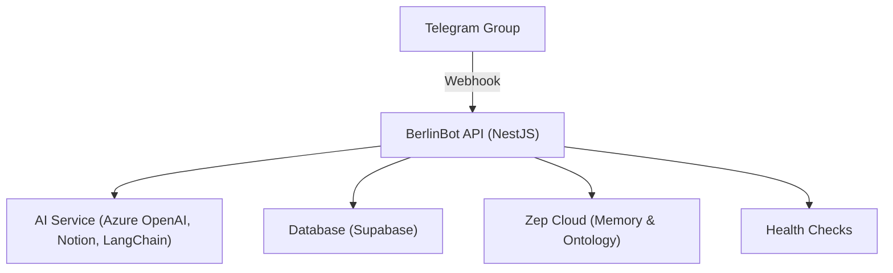

<p align="center">
  
</p>

<h1 align="center">BerlinBot</h1>

<p align="center">
  <b>Open source AI-powered Telegram assistant for communities, built with NestJS, Supabase, Azure OpenAI, Notion, and Zep. Maintained by and for members of the Frontier Tower.</b>
</p>

<p align="center">
  <a href="https://www.npmjs.com/~nestjscore" target="_blank"></a>
  <a href="https://www.npmjs.com/~nestjscore" target="_blank"></a>
  <a href="https://www.npmjs.com/~nestjscore" target="_blank"></a>
  <a href="https://circleci.com/gh/nestjs/nest" target="_blank"></a>
  <a href="https://coveralls.io/github/nestjs/nest?branch=master" target="_blank"></a>
  <a href="https://discord.gg/G7Qnnhy" target="_blank"></a>
</p>

---

## 🚀 What is BerlinBot?

BerlinBot is an open source AI-powered Telegram assistant designed for community groups. It leverages advanced LLMs (Azure OpenAI via LangChain), Notion knowledge, persistent memory, and a community knowledge graph to answer questions, summarize discussions, and provide insights—all within your Telegram group.

**Key Features:**

- **AI Q&A:** Ask questions in your group, get answers powered by Azure OpenAI, Notion, and vector search.
- **Persistent Memory & Knowledge Graph:** All messages and members are stored in Supabase and Zep for context-aware responses and relationship reasoning.
- **Ontology:** Models users, projects, events, interests, and their relationships for advanced community insights.
- **Easy Telegram Integration:** Add BerlinBot to your group and start chatting.
- **Health Checks:** Production-ready with health endpoints.
- **Cloud Native:** Deployable on your own infrastructure, Docker, or any Node.js-compatible cloud.

---

## 🏗️ Architecture Overview



- **NestJS**: Main application framework.
- **Azure OpenAI + Notion (via MCP server) + LangChain**: AI answers with Notion as a knowledge base and vector search for context.
- **Supabase**: Stores messages, members, and vectors.
- **Zep**: Persistent memory and community knowledge graph (ontology).

---

## ⚡ Quickstart

### 1. Clone & Install

```bash
$ git clone <your-repo-url>
$ cd berlinbot
$ yarn install
```

### 2. Environment Setup

Create a `.env` file with the following (see your cloud providers for values):

```env
BOT_TOKEN=your-telegram-bot-token
WEBHOOK_BASE_URL=https://your-ngrok-or-cloud-url
TELEGRAM_WEBHOOK_SECRET=your-telegram-webhook-secret
SUPABASE_URL=your-supabase-url
SUPABASE_SERVICE_ROLE_KEY=your-supabase-service-role-key
ZEP_API_KEY=your-zep-api-key
NOTION_API_KEY=your-notion-api-key
EMBEDDING_MODEL=your-azure-embedding-model
REASONING_MODEL=your-azure-chat-model
PORT=3000
```

### 3. Run Locally

```bash
# Development
$ yarn start:dev

# Production
$ yarn start:prod
```

### 4. Test

```bash
# Unit tests
$ yarn test
# E2E tests
$ yarn test:e2e
# Coverage
$ yarn test:cov
```

---

## 🤖 Telegram Integration

- Add your bot to a Telegram group.
- Set the webhook to your deployed endpoint (`/api/v1/core/telegram/webhook`).
- Use `/ask <question>` in the group to get AI-powered answers.
- All group messages are processed for context and memory.

---

## 🧠 AI, Notion & Vector Search

- Uses Azure OpenAI for LLM responses, orchestrated by LangChain.
- Integrates with Notion (via MCP server) for up-to-date knowledge.
- Vector search (via Supabase Edge Function and LangChain) is always performed before Notion lookup for context-rich answers.
- Custom system prompt and tool usage order are codified in the prompts.

---

## 🗄️ Database, Memory & Ontology

- **Supabase**: Stores all messages and members for analytics and context.
- **Zep Cloud**: Adds persistent memory and a community knowledge graph (ontology) for advanced context, recommendations, and relationship reasoning.
- **Ontology**: Models users, projects, events, interests, and their relationships (e.g., MEMBER_OF, WORKS_ON, ATTENDS).
- **Supabase Edge Functions**: Used for embedding and vector operations (see `supabase/functions/embedding`).

---

## 🩺 Health Checks

- `/health`: Health check endpoint (uses NestJS Terminus).

---

## 🚀 Deployment

### Docker

BerlinBot can be deployed easily with Docker:

```bash
docker build -t berlinbot .
docker run -p 3000:3000 --env-file .env berlinbot
```

### Custom/Cloud

- Deploy anywhere Node.js runs (AWS, GCP, DigitalOcean, etc.).
- Set environment variables as above.

---

## 📁 Project Structure

- `src/ai/` — AI service and module (LLM, memory, ontology, tools)
- `src/telegram/` — Telegram bot logic and integration
- `src/database/` — Database and memory integration
- `src/health/` — Health check endpoint
- `src/config/` — Configuration providers (e.g., Supabase)
- `src/common/prompts/` — System and QA prompts
- `src/common/schema/` — Shared schema definitions
- `supabase/functions/embedding/` — Supabase Edge Function for embeddings
- `test/` — E2E and integration tests

---

## 🙌 Contributing

BerlinBot is open source and welcomes contributions from all members of the Frontier Tower and the wider community! Please open issues or pull requests for features, bugfixes, or documentation improvements.

---

## 💬 Support & Resources

- [NestJS Documentation](https://docs.nestjs.com)
- [Supabase Docs](https://supabase.com/docs)
- [Zep Cloud](https://getzep.com/)
- [Notion API](https://developers.notion.com/)
- [LangChain](https://js.langchain.com/)
- [Azure OpenAI](https://learn.microsoft.com/en-us/azure/ai-services/openai/)

---

## 📝 License

BerlinBot is currently unlicensed for commercial use. See `package.json` for details. For open source or community use, please contact the maintainers.
