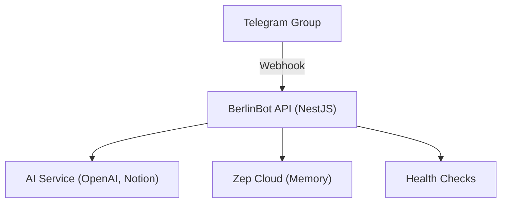

<p align="center">
  
</p>

<h1 align="center">BerlinBot</h1>

<p align="center">
  <b>AI-powered Telegram assistant for communities, built with NestJS, Zep, and Notion.</b>
</p>

<p align="center">
  <a href="https://www.npmjs.com/~nestjscore" target="_blank"></a>
  <a href="https://www.npmjs.com/~nestjscore" target="_blank"></a>
  <a href="https://www.npmjs.com/~nestjscore" target="_blank"></a>
  <a href="https://circleci.com/gh/nestjs/nest" target="_blank"></a>
  <a href="https://coveralls.io/github/nestjs/nest?branch=master" target="_blank"></a>
  <a href="https://discord.gg/G7Qnnhy" target="_blank"></a>
</p>

---

## 🚀 What is BerlinBot?

BerlinBot is an AI-powered Telegram assistant designed for community groups. It leverages advanced LLMs, Notion knowledge, and persistent memory to answer questions, summarize discussions, and provide insights—all within your Telegram group.

**Key Features:**

- **AI Q&A:** Ask questions in your group, get answers powered by OpenAI and Notion.
- **Persistent Memory:** All messages and members are stored in Zep for context-aware responses.
- **Easy Telegram Integration:** Add BerlinBot to your group and start chatting.
- **Health Checks & Background Tasks:** Production-ready with health endpoints and scheduled jobs.
- **Cloud Native:** Deployable on Vercel, AWS, or your own infrastructure.

---

## 🏗️ Architecture Overview



- **NestJS**: Main application framework.
- **grammY**: Telegram bot API.
- **OpenAI + Notion**: AI answers with Notion as a knowledge base.
- **Zep**: Vector memory and user graph.
- **Vercel**: Optional serverless deployment.

---

## ⚡ Quickstart

### 1. Clone & Install

```bash
$ git clone <your-repo-url>
$ cd frontiertower-core-api
$ yarn install
```

### 2. Environment Setup

Create a `.env` file with the following (see your cloud providers for values):

```env
BOT_TOKEN=your-telegram-bot-token
WEBHOOK_BASE_URL=https://your-ngrok-or-vercel-url
TELEGRAM_WEBHOOK_SECRET=your-telegram-webhook-secret
ZEP_API_KEY=your-zep-api-key
NOTION_API_KEY=your-notion-api-key
PORT=3000
```

### 3. Run Locally

```bash
# Development
$ yarn start:dev

# Production
$ yarn start:prod
```

### 4. Test

```bash
# Unit tests
$ yarn test
# E2E tests
$ yarn test:e2e
# Coverage
$ yarn test:cov
```

---

## 🤖 Telegram Integration

- Add your bot to a Telegram group.
- Set the webhook to your deployed endpoint (`/api/v1/core/telegram/webhook`).
- Use `/ask <question>` in the group to get AI-powered answers.
- All group messages are processed for context and memory.

---

## 🧠 AI & Notion Integration

- Uses OpenAI (via Azure) for LLM responses.
- Integrates with Notion via MCP for up-to-date knowledge.
- Custom system prompt: "You are a helpful AI assistant that always references Notion for data and information."

---

## 🧠 Memory & Context

- **Zep Cloud**: Adds vector memory and user graph for advanced context and recommendations.

---

## 🩺 Health Checks & Background Tasks

- `/health`: Health check endpoint (uses NestJS Terminus).
- Scheduled background jobs (e.g., every 5 minutes) for maintenance/logging.

---

## 🚀 Deployment

### Vercel

BerlinBot is ready for serverless deployment on Vercel. See `vercel.json` for configuration.

### Custom/Cloud

- Deploy anywhere Node.js runs (AWS, GCP, DigitalOcean, etc.).
- Set environment variables as above.

---

## 📁 Project Structure

- `src/ai/` — AI service and module
- `src/telegram/` — Telegram bot logic
- `src/tasks/` — Scheduled/background tasks
- `src/health/` — Health check endpoint
- `src/config/` — Configuration providers
- `static/` — Static assets (e.g., favicon)

---

## 🙌 Contributing

BerlinBot is open to contributions! Please open issues or pull requests for features, bugfixes, or documentation improvements.

---

## 💬 Support & Resources

- [NestJS Documentation](https://docs.nestjs.com)
- [grammY Telegram Bot API](https://grammy.dev/)
- [Zep Cloud](https://getzep.com/)
- [Notion API](https://developers.notion.com/)
- [Vercel](https://vercel.com/)
- [Discord Community](https://discord.gg/G7Qnnhy)

---

## 📝 License

BerlinBot is [MIT licensed](LICENSE).
